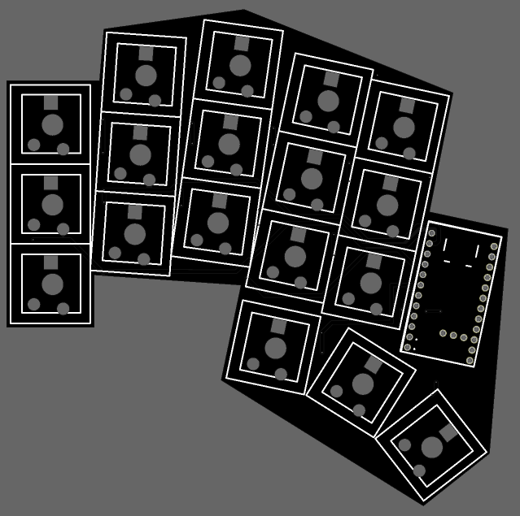
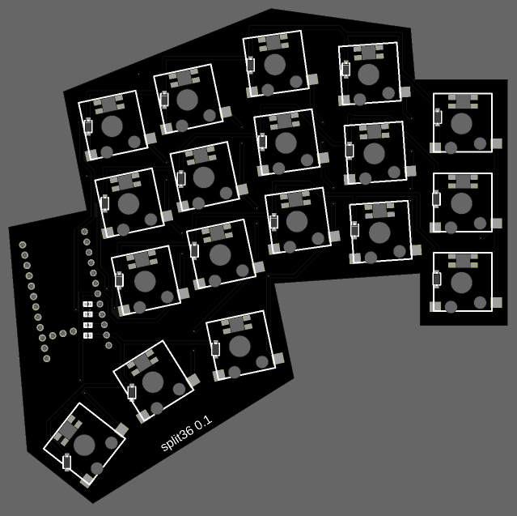

# split36 keyboard

Low-profile 36-key split keyboard.



> EasyEDA-PRO project


## TODOs

- Find keycaps and batteries


## Components

- **2** x [PCB](https://jlcpcb.com) (~5$)
- **36** x [GATERON KS-33 Low Profile 2.0 Switch](https://www.gateron.com/products/gateron-ks-33-low-profile-switch-set) (~10$)
- **36** x [GATERON Hot-swap 2.0 Socket](https://www.gateron.com/products/gateron-low-profile-switch-hot-swap-pcb-socket) (~5$)
- **36** x (3d printed?) Keycap($?)

1. Wired

    - 2 x [Pro Micro](https://www.optimusdigital.ro/ro/compatibile-cu-arduino-pro-micro/12880-placa-de-dezvoltare-compatibila-cu-pro-micro-cu-mufa-type-c.html) (~15$)

2. Wireless

    - 2 x [nice!nano v2](https://nicekeyboards.com/nice-nano) (~55$)
    - 2 x [Li-Po Battery](https://kriscables.com/product/li-po-battery-3-7v-110mah) (~20$?)

> Alternatives: ?

[supermini nRF52840](https://www.aliexpress.us/item/3256805848952479.html) (nice!nano v2 compatible with2 alternative) (7$)(+6$ shipping)


## Price: 

1. **Wired**: 35$
```diff
-Not including:
-  Keycaps
-  Shipping (5$)
```

2. **Wireless**: 35$
```diff
-Not including:
-  Keycaps
-  Batteries
-  2.4GHz receiver
-  Shipping (11$)
```


## Stores

- https://jlcpcb.com
- https://gateron.com
- https://optimusdigital.ro
- https://nicekeyboards.com
